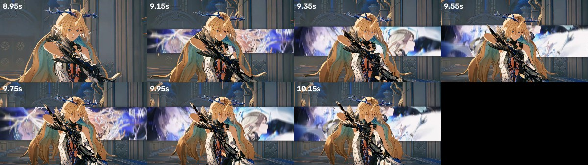

> Analysis of the clip pushed to `main`. Generated by `python3 -m vfxscan.cli inbox/cartethyia.mp4 -o analysis_out`.
>
> 
> *The signature effect: an animated horizontal band swapping the background behind a masked subject (8.95s → 10.15s).*

# Video effects analysis — `cartethyia.mp4`

*16.33s · 1024×576 · 30.00 fps · h264 · 5.9 MB*

## What's on this video

### Color grade

| Effect | Confidence | Where | Evidence |
|---|---|---|---|
| **Lifted blacks (matte / faded film curve)** | ●●●●○ 82% | 2/9 shots: 0:03.9–0:04.6, 0:14.4–0:15.6 | 1st-percentile luma sits at 55/255 instead of ~0 — the shadows are floated, the classic 'faded film' or S-curve-with-lifted-toe look |
| **Teal-and-orange split tone** | ●●●●○ 73% | 2/9 shots: 0:08.9–0:10.2, 0:14.4–0:15.6 | shadows lean blue (R−B = -19.0) while highlights lean warm (R−B = +16.3) — the standard blockbuster/creator split-tone |
| **Cool white balance / blue cast** | ●●●○○ 67% | 7/9 shots: 0:00.1–0:00.9, 0:01.3–0:01.9, 0:02.6–0:03.2, 0:03.9–0:04.6 (+3 more) | mean R/B ratio 0.74 across the video |
| **Rolled-off / compressed highlights** | ●●●○○ 62% | 7/9 shots: 0:00.1–0:00.9, 0:01.3–0:01.9, 0:02.6–0:03.2, 0:03.9–0:04.6 (+3 more) | 99th-percentile luma only reaches 213/255 — highlights pulled down, low-contrast or 'log-ish' finish |
| **Low-contrast / flat grade** | ●●●○○ 60% | 2/9 shots: 0:01.3–0:01.9, 0:03.9–0:04.6 | usable luma range is only 149/255 (median frame contrast σ=41) |
| **Split toning present** | ●●○○○ 49% | 4/9 shots: 0:01.3–0:01.9, 0:02.6–0:03.2, 0:07.0–0:07.5, 0:11.8–0:13.0 | shadow/highlight colour separation of 10.9 in R−B |

### Texture

| Effect | Confidence | Where | Evidence |
|---|---|---|---|
| **Vignette** | ●●●●○ 90% | whole video | corners are 45% darker than frame centre |
| **Sharpening halos** | ●●●●○ 72% | 4/9 shots: 0:00.1–0:00.9, 0:01.3–0:01.9, 0:03.9–0:04.6, 0:05.5–0:06.2 | edge-adjacent detail energy is 3.08x the frame average — ringing typical of an unsharp-mask / 'clarity' pass or aggressive re-encode |
| **Bloom / glow on highlights** | ●●●○○ 67% | 4/9 shots: 0:00.1–0:00.9, 0:07.0–0:07.5, 0:08.9–0:10.2, 0:11.8–0:13.0 | pixels ringing bright highlights are 1.64x brighter than the surrounding field — diffusion filter, bloom, or 'dreamy' glow effect |
| **Inverse vignette / centre darkening** | ●●○○○ 42% | 1/9 shots: 0:14.4–0:15.6 | corners are 49% brighter than centre |

### Camera

| Effect | Confidence | Where | Evidence |
|---|---|---|---|
| **Continuous slow zoom / Ken Burns push-out** | ●●●○○ 60% | 5/9 shots: 0:00.1–0:00.9, 0:02.6–0:03.2, 0:07.0–0:07.5, 0:08.9–0:10.2 (+1 more) | 87% of frames carry a sub-1% scale change in a consistent direction |
| **Continuous slow zoom / Ken Burns push-in** | ●●●○○ 58% | 4/9 shots: 0:01.3–0:01.9, 0:03.9–0:04.6, 0:05.5–0:06.2, 0:11.8–0:13.0 | 100% of frames carry a sub-1% scale change in a consistent direction |

### Graphics

| Effect | Confidence | Where | Evidence |
|---|---|---|---|
| **Persistent overlay (burned-in text, caption bar, logo or watermark)** | ●●●●○ 75% | 3/9 shots: 0:07.0–0:07.5, 0:08.9–0:10.2, 0:14.4–0:15.6 | 20 edge clusters hold still for the whole video (temporal σ < 6), concentrated in the middle third, covering 0.2% of the frame |
| **On-screen text / motion graphics that change over time** | ●●○○○ 46% | 1/9 shots: 0:08.9–0:10.2 | edge density averages 19% of pixels and swings ±2% — text or graphic elements appearing and leaving |

### Editing

| Effect | Confidence | Where | Evidence |
|---|---|---|---|
| **Rapid-fire cutting** | ●●●●○ 80% | whole video | 25 transitions in 16.3s (92/min), median shot length 0.57s |
| **Soft transitions in use** | ●●●●○ 75% | whole video | 1x dissolve, 1x fade black, 2x fade white, 3x wipe — the editor is blending shots, not only butt-cutting |

### Audio

| Effect | Confidence | Where | Evidence |
|---|---|---|---|
| **crest factor only 7.4 dB** | ●●●○○ 60% | whole video | crest factor only 7.4 dB — audio is heavily compressed / limited / loudness-normalised (music-bed style mastering) |
| **peaks reach 0 dBFS** | ●●●○○ 60% | whole video | peaks reach 0 dBFS — brickwall limiting or clipping on export |
| **steady rhythmic pulse ≈ 177 BPM** | ●●●○○ 60% | whole video | steady rhythmic pulse ≈ 177 BPM — a music bed is driving the edit |
| **9 broadband high-frequency bursts detected** | ●●●○○ 60% | whole video | 9 broadband high-frequency bursts detected — whoosh / riser / transition SFX |

### Pipeline

| Effect | Confidence | Where | Evidence |
|---|---|---|---|
| **Editor / device fingerprint in container** | ●●●●○ 80% | whole video | FFmpeg (Lavf) — programmatic or re-wrapped export |

## Shot breakdown (9 shots)

| # | In | Out | Length |
|---|---|---|---|
| 1 | `0:00.10` | `0:00.87` | 0.77s |
| 2 | `0:01.27` | `0:01.90` | 0.63s |
| 3 | `0:02.60` | `0:03.20` | 0.60s |
| 4 | `0:03.93` | `0:04.63` | 0.70s |
| 5 | `0:05.50` | `0:06.17` | 0.66s |
| 6 | `0:07.00` | `0:07.50` | 0.50s |
| 7 | `0:08.87` | `0:10.23` | 1.36s |
| 8 | `0:11.77` | `0:13.03` | 1.26s |
| 9 | `0:14.40` | `0:15.63` | 1.23s |

## Effect timeline

| Time | Event | Duration | Detail |
|---|---|---|---|
| `0:00.20 → 0:00.67` | Zoom out | 0.47s | scale x0.90 over 0.47s |
| `0:00.97 → 0:01.17` | Whip pan / motion-blur transition | 0.20s | |motion|=36.7px/frame with sharpness drop |
| `0:01.03` | Flash / light-leak hit | 0.03s | +37 luma spike |
| `0:01.47 → 0:01.77` | Zoom / punch in | 0.30s | scale x1.08 over 0.30s |
| `0:02.00 → 0:02.23` | Whip pan / motion-blur transition | 0.23s | |motion|=33.9px/frame with sharpness drop |
| `0:02.13` | Flash / light-leak hit | 0.03s | +122 luma spike |
| `0:02.33 → 0:02.50` | Whip pan / motion-blur transition | 0.17s | |motion|=49.9px/frame with sharpness drop |
| `0:02.90` | Flash / light-leak hit | 0.00s | +16 luma spike |
| `0:03.13` | Flash / light-leak hit | 0.03s | +22 luma spike |
| `0:03.30 → 0:03.73` | Whip pan / motion-blur transition | 0.43s | |motion|=172.7px/frame with sharpness drop |
| `0:03.83` | Whip pan / motion-blur transition | 0.00s | |motion|=68.5px/frame with sharpness drop |
| `0:04.03 → 0:04.40` | Zoom / punch in | 0.37s | scale x1.60 over 0.37s |
| `0:04.73` | Whip pan / motion-blur transition | 0.00s | |motion|=48.8px/frame with sharpness drop |
| `0:05.13 → 0:05.30` | Wipe / slice reveal | 0.17s | vertical edge / horizontal travel — change is spatially partitioned, not uniform (row σ=0.15, col σ=0.24); reads as a wipe/slice reveal rather than a dissolve |
| `0:05.17 → 0:05.40` | Whip pan / motion-blur transition | 0.23s | |motion|=33.7px/frame with sharpness drop |
| `0:05.57 → 0:05.90` | Zoom / punch in | 0.33s | scale x1.11 over 0.33s |
| `0:06.27` | Whip pan / motion-blur transition | 0.03s | |motion|=18.3px/frame with sharpness drop |
| `0:06.73` | Flash / light-leak hit | 0.00s | +15 luma spike |
| `0:06.77 → 0:06.90` | Whip pan / motion-blur transition | 0.13s | |motion|=23.6px/frame with sharpness drop |
| `0:07.60 → 0:07.73` | Wipe / slice reveal | 0.13s | vertical edge / horizontal travel — change is spatially partitioned, not uniform (row σ=0.18, col σ=0.27); reads as a wipe/slice reveal rather than a dissolve |
| `0:07.63` | Whip pan / motion-blur transition | 0.10s | |motion|=36.1px/frame with sharpness drop |
| `0:08.23` | Flash / light-leak hit | 0.03s | +65 luma spike |
| `0:08.23` | Whip pan / motion-blur transition | 0.07s | |motion|=32.6px/frame with sharpness drop |
| `0:08.77` | Flash / light-leak hit | 0.10s | +102 luma spike |
| `0:08.77` | Whip pan / motion-blur transition | 0.00s | |motion|=39.8px/frame with sharpness drop |
| `0:08.87 → 0:09.77` | Zoom out | 0.90s | scale x0.68 over 1.03s |
| `0:10.33 → 0:10.57` | Dissolve / crossfade | 0.23s | 0.23s cross-blend (ρ to outgoing +0.60, to incoming -0.93) |
| `0:10.43` | Whip pan / motion-blur transition | 0.00s | |motion|=45.6px/frame with sharpness drop |
| `0:10.90` | Hard cut | 0.03s | hist Δ=0.954, pixel Δ=111.4 |
| `0:10.93` | Flash / light-leak hit | 0.10s | +105 luma spike |
| `0:10.93` | Whip pan / motion-blur transition | 0.00s | |motion|=55.1px/frame with sharpness drop |
| `0:11.17 → 0:11.67` | Wipe / slice reveal | 0.50s | vertical edge / horizontal travel — change is spatially partitioned, not uniform (row σ=0.19, col σ=0.23); reads as a wipe/slice reveal rather than a fade white |
| `0:11.43` | Whip pan / motion-blur transition | 0.03s | |motion|=197.5px/frame with sharpness drop |
| `0:12.03` | Flash / light-leak hit | 0.00s | +44 luma spike |
| `0:12.33` | Flash / light-leak hit | 0.03s | +17 luma spike |
| `0:12.73` | Flash / light-leak hit | 0.03s | +18 luma spike |
| `0:13.07` | Flash / light-leak hit | 0.07s | +61 luma spike |
| `0:13.13` | Whip pan / motion-blur transition | 0.00s | |motion|=20.2px/frame with sharpness drop |
| `0:13.53 → 0:13.87` | Fade through white | 0.33s | luma ramps through white over 0.33s |
| `0:13.57 → 0:13.70` | Whip pan / motion-blur transition | 0.13s | |motion|=190.3px/frame with sharpness drop |
| `0:14.03 → 0:14.30` | Fade through white | 0.27s | luma ramps through white over 0.27s |
| `0:14.10` | Whip pan / motion-blur transition | 0.00s | |motion|=35.4px/frame with sharpness drop |
| `0:14.40 → 0:14.90` | Zoom out | 0.50s | scale x0.71 over 0.90s |
| `0:15.73 → 0:16.30` | Fade through black | 0.57s | luma ramps through black over 0.57s |
| `0:15.73` | Whip pan / motion-blur transition | 0.00s | |motion|=86.6px/frame with sharpness drop |

## Audio

- Mean level **-7.4 dBFS**, peak **0.0 dBFS**, crest factor **7.4 dB**
- Rhythmic pulse ≈ **177 BPM**
- **100%** of cuts land within 120 ms of an audio onset — the edit is cut to the beat
- 9 whoosh/riser-style bursts at 0:00.05, 0:00.46, 0:01.02, 0:01.70, 0:02.18, 0:04.04, 0:04.71, 0:06.52, 0:07.04
- crest factor only 7.4 dB — audio is heavily compressed / limited / loudness-normalised (music-bed style mastering)
- peaks reach 0 dBFS — brickwall limiting or clipping on export
- steady rhythmic pulse ≈ 177 BPM — a music bed is driving the edit
- 9 broadband high-frequency bursts detected — whoosh / riser / transition SFX

## Source & export pipeline

- Container: `mov`, video `h264 High`, pixel format `yuv420p`
- Video bitrate **2852 kb/s** (0.161 bits/pixel/frame)
- Audio: `aac` 44100 Hz stereo @ 32 kb/s
- **Toolchain fingerprints in the container: FFmpeg (Lavf) — programmatic or re-wrapped export**

Container metadata tags

- `major_brand`: isom
- `compatible_brands`: isomiso2avc1mp41
- `comment`: vid:v15025gf0000d8tulbfog65scsb2i5ng
- `encoder`: Lavf58.76.100

## Generated artefacts

- **Signal timeline** — `timeline.png`
- **Contact sheet** — `contact_sheet.png`
- **Reference stills** — `frames`
- **RGB scopes** — `scopes.png`

---

*Method: every sampled frame is measured for exposure, contrast, saturation, split-toning, grain (Immerkaer estimator at native resolution), sharpening halos, bloom, chromatic aberration, vignetting and letterboxing; motion is recovered by phase correlation (translation) and log-polar phase correlation (scale); shot changes come from Bhattacharyya distance between HSV histograms, with transitions classified by the shape of the signal. Confidences are heuristic — treat them as 'how strongly the pixels support this', not as ground truth about the editor's intent.*