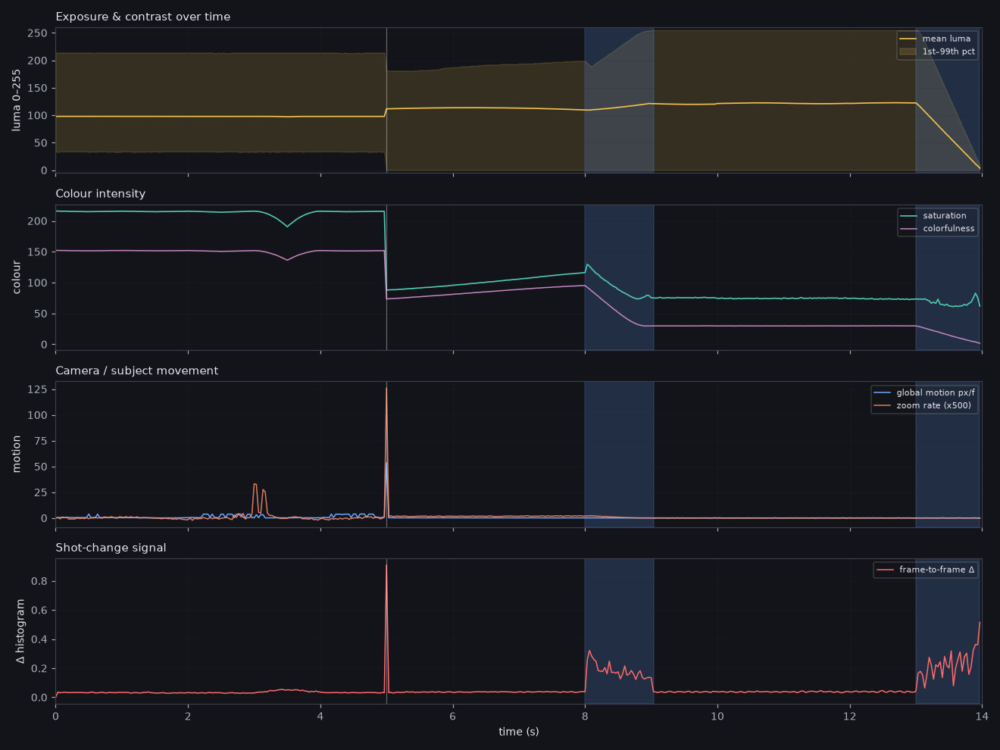

> **This is the self-test output**, produced by running `vfxscan` on
> `tests/make_fixture.py` — a clip with effects deliberately baked in so the
> detectors can be scored against known truth. Ground truth was: hard cut at
> **5.00s**, 1s dissolve at **8.00s**, 1s fade to black at **13.00s**, warm
> grade + lifted blacks + vignette + grain + slow zoom on shot 1, cool grade +
> letterbox + 8px RGB split on shot 2, grain + burned-in caption on shot 3.
>
> Compare that list against what the report below found on its own.

# Video effects analysis — `fixture_known_effects.mp4`

*14.00s · 854×480 · 30.00 fps · h264 · 31.1 MB*

## What's on this video

### Color grade

| Effect | Confidence | Where | Evidence |
|---|---|---|---|
| **Lifted blacks (matte / faded film curve)** | ●●●●○ 82% | 1/3 shots: 0:00.1–0:04.9 | 1st-percentile luma sits at 34/255 instead of ~0 — the shadows are floated, the classic 'faded film' or S-curve-with-lifted-toe look |
| **Teal-and-orange split tone** | ●●●●○ 75% | 1/3 shots: 0:09.1–0:12.9 | shadows lean blue (R−B = -11.8) while highlights lean warm (R−B = +12.4) — the standard blockbuster/creator split-tone |
| **Heavily saturated / vibrance push** | ●●●○○ 66% | 1/3 shots: 0:00.1–0:04.9 | median HSV saturation 215/255, colorfulness index 152 |
| **Crushed blacks** | ●●●○○ 66% | 2/3 shots: 0:05.1–0:07.9, 0:09.1–0:12.9 | 21% of pixels sit at pure black — contrast pushed until the toe clips |
| **Warm white balance / orange cast** | ●●●○○ 62% | 1/3 shots: 0:00.1–0:04.9 | mean R/B ratio 1.12 across the video |
| **Cool white balance / blue cast** | ●●●○○ 62% | 1/3 shots: 0:05.1–0:07.9 | mean R/B ratio 0.76 across the video |
| **Rolled-off / compressed highlights** | ●●●○○ 61% | 2/3 shots: 0:00.1–0:04.9, 0:05.1–0:07.9 | 99th-percentile luma only reaches 214/255 — highlights pulled down, low-contrast or 'log-ish' finish |
| **Blown highlights** | ●●●○○ 53% | 1/3 shots: 0:09.1–0:12.9 | 10% of pixels clipped at white |
| **High-contrast / punchy grade** | ●●●○○ 53% | 1/3 shots: 0:09.1–0:12.9 | luma spans 255/255 with high per-frame σ=88 |
| **Split toning present** | ●●●○○ 52% | 2/3 shots: 0:00.1–0:04.9, 0:05.1–0:07.9 | shadow/highlight colour separation of 99.1 in R−B |

### Texture

| Effect | Confidence | Where | Evidence |
|---|---|---|---|
| **Film grain / added noise** | ●●●●○ 85% | 2/3 shots: 0:00.1–0:04.9, 0:09.1–0:12.9 | heavy — Immerkaer noise estimate σ=8.8 on native-resolution centre crops (clean digital footage is typically < 2.5) |
| **Vignette** | ●●●●○ 79% | 1/3 shots: 0:00.1–0:04.9 | corners are 63% darker than frame centre |
| **RGB channel split (glitch / chroma-shift effect)** | ●●●●○ 75% | 1/3 shots: 0:05.1–0:07.9 | red and blue planes sit 5.93px apart in the same direction across the whole frame — a deliberate chroma-shift, not lens behaviour |
| **Sharpening halos** | ●●●●○ 70% | 1/3 shots: 0:05.1–0:07.9 | edge-adjacent detail energy is 3.91x the frame average — ringing typical of an unsharp-mask / 'clarity' pass or aggressive re-encode |
| **Bloom / glow on highlights** | ●●●●○ 70% | 1/3 shots: 0:09.1–0:12.9 | pixels ringing bright highlights are 1.89x brighter than the surrounding field — diffusion filter, bloom, or 'dreamy' glow effect |
| **Inverse vignette / centre darkening** | ●●○○○ 44% | 1/3 shots: 0:05.1–0:07.9 | corners are 17% brighter than centre |

### Framing

| Effect | Confidence | Where | Evidence |
|---|---|---|---|
| **Letterbox bars (cinematic crop)** | ●●●●○ 75% | 1/3 shots: 0:05.1–0:07.9 | matching black bars top & bottom covering 21% of frame height — effective aspect ratio ≈ 2.26:1 |

### Camera

| Effect | Confidence | Where | Evidence |
|---|---|---|---|
| **Locked-off / static camera** | ●●●○○ 66% | 1/3 shots: 0:09.1–0:12.9 | 100% of frames show < 0.25px global motion and no scale change |
| **Continuous slow zoom / Ken Burns push-in** | ●●●○○ 61% | 2/3 shots: 0:00.1–0:04.9, 0:05.1–0:07.9 | 73% of frames carry a sub-1% scale change in a consistent direction |

### Graphics

| Effect | Confidence | Where | Evidence |
|---|---|---|---|
| **Persistent overlay (burned-in text, caption bar, logo or watermark)** | ●●●○○ 66% | 2/3 shots: 0:05.1–0:07.9, 0:09.1–0:12.9 | 14 edge clusters hold still for the whole video (temporal σ < 6), concentrated in the middle third, covering 6% of the frame |

### Editing

| Effect | Confidence | Where | Evidence |
|---|---|---|---|
| **Soft transitions in use** | ●●●●○ 75% | whole video | 1x dissolve, 1x fade black — the editor is blending shots, not only butt-cutting |
| **Measured / long-take editing** | ●●●○○ 60% | whole video | 3 transitions in 14.0s (13/min), median shot length 7.00s |

### Audio

| Effect | Confidence | Where | Evidence |
|---|---|---|---|
| **2 broadband high-frequency bursts detected** | ●●●○○ 60% | whole video | 2 broadband high-frequency bursts detected — whoosh / riser / transition SFX |

### Pipeline

| Effect | Confidence | Where | Evidence |
|---|---|---|---|
| **Editor / device fingerprint in container** | ●●●●○ 80% | whole video | FFmpeg (Lavf) — programmatic or re-wrapped export |

## Shot breakdown (3 shots)

| # | In | Out | Length |
|---|---|---|---|
| 1 | `0:00.10` | `0:04.87` | 4.77s |
| 2 | `0:05.10` | `0:07.90` | 2.80s |
| 3 | `0:09.13` | `0:12.90` | 3.76s |

## Effect timeline

| Time | Event | Duration | Detail |
|---|---|---|---|
| `0:02.83 → 0:03.37` | Zoom / punch in | 0.53s | scale x1.34 over 0.53s |
| `0:04.97` | Hard cut | 0.03s | hist Δ=0.909, pixel Δ=64.3 |
| `0:05.10 → 0:07.90` | Zoom / punch in | 2.80s | scale x1.80 over 3.53s |
| `0:08.00 → 0:09.03` | Dissolve / crossfade | 1.03s | 1.03s cross-blend (ρ to outgoing +0.93, to incoming -0.99) |
| `0:13.00 → 0:13.97` | Fade through black | 0.97s | luma ramps through black over 0.97s |

## Audio

- Mean level **-32.5 dBFS**, peak **-13.2 dBFS**, crest factor **19.4 dB**
- **0%** of cuts land within 120 ms of an audio onset 
- 2 whoosh/riser-style bursts at 0:07.48, 0:07.85
- 2 broadband high-frequency bursts detected — whoosh / riser / transition SFX

## Source & export pipeline

- Container: `mov`, video `h264 High`, pixel format `yuv420p`
- Video bitrate **17618 kb/s** (1.433 bits/pixel/frame)
- Audio: `aac` 44100 Hz mono @ 131 kb/s
- **Toolchain fingerprints in the container: FFmpeg (Lavf) — programmatic or re-wrapped export**

Container metadata tags

- `major_brand`: isom
- `compatible_brands`: isomiso2avc1mp41
- `encoder`: Lavf61.1.100
- `comment`: made with vfxscan fixture generator

## Generated artefacts

- **Signal timeline** — `timeline.png`
- **Contact sheet** — `contact_sheet.png`
- **Reference stills** — `frames`
- **RGB scopes** — `scopes.png`

---

*Method: every sampled frame is measured for exposure, contrast, saturation, split-toning, grain (Immerkaer estimator at native resolution), sharpening halos, bloom, chromatic aberration, vignetting and letterboxing; motion is recovered by phase correlation (translation) and log-polar phase correlation (scale); shot changes come from Bhattacharyya distance between HSV histograms, with transitions classified by the shape of the signal. Confidences are heuristic — treat them as 'how strongly the pixels support this', not as ground truth about the editor's intent.*